# 🎨 Diagramas Visuales - Process Monitor v2

## 1. Arquitectura de Componentes

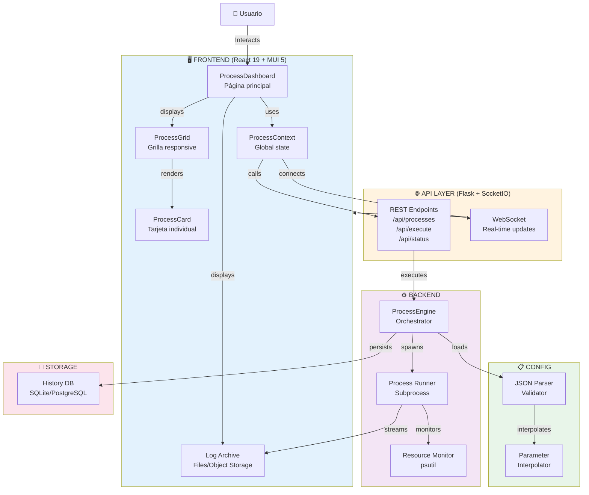

---

## 2. Flujo de Ejecución Manual

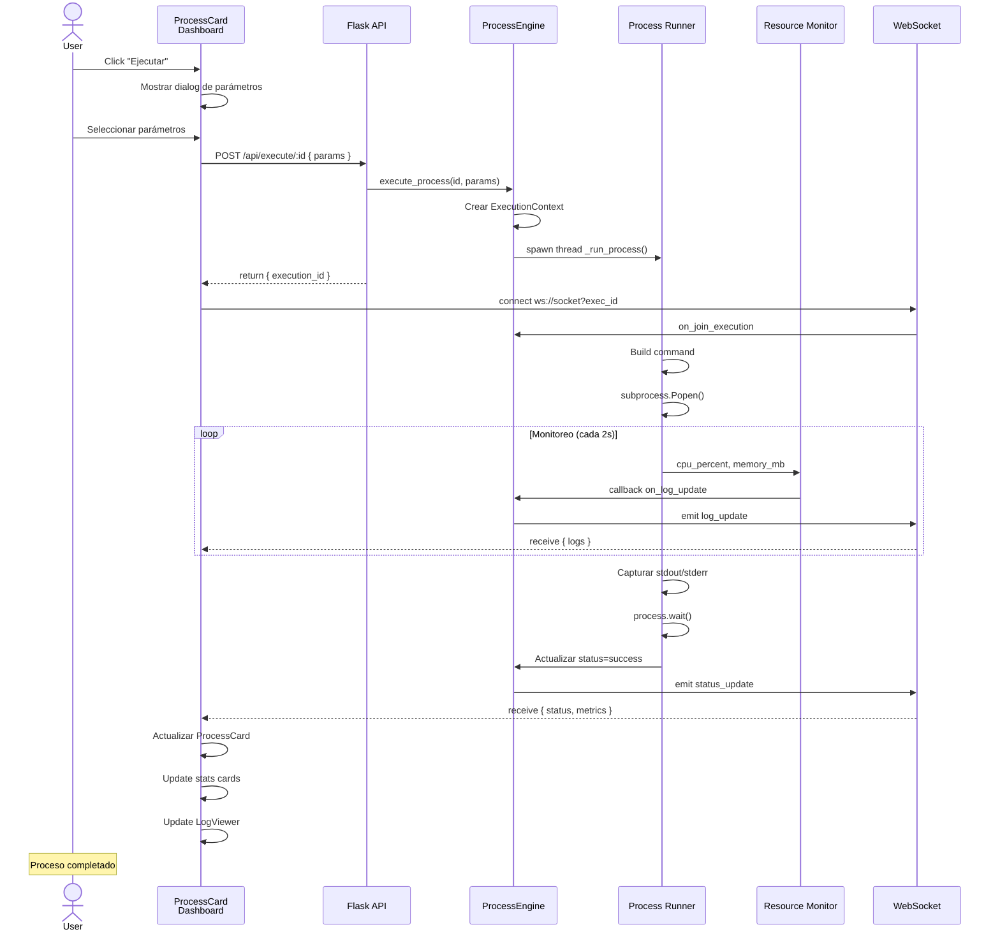

---

## 3. Estructura de Datos

```mermaid
graph LR
    subgraph ProcessDefinition["ProcessDefinition"]
        id["id: string"]
        name["name: string"]
        project["project: string"]
        type["type: ProcessType"]
        command["command: CommandConfig"]
        parameters["parameters[]"]
        schedule["schedule: ScheduleConfig"]
        notifications["notifications"]
    end
    
    subgraph ExecutionContext["ExecutionContext"]
        exec_id["execution_id"]
        exec_status["status: ProcessStatus"]
        start["start_time"]
        end["end_time"]
        exec_parameters["parameters: Dict"]
        logs["logs: LogEntry[]"]
        resources["resources: ResourceMetrics"]
    end
    
    subgraph ResourceMetrics["ResourceMetrics"]
        cpu["cpu_percent"]
        mem["memory_mb"]
        peak["peak_memory_mb"]
    end
    
    subgraph LogEntry["LogEntry"]
        timestamp["timestamp: ISO8601"]
        level["level: 'debug'|'info'|'warning'|'error'"]
        message["message: string"]
        source["source: string"]
    end
    
    ProcessDefinition -.->|defines| ExecutionContext
    ExecutionContext -->|collects| ResourceMetrics
    ExecutionContext -->|streams| LogEntry
    
    style ProcessDefinition fill:#e3f2fd,stroke:#1976d2,stroke-width:2px
    style ExecutionContext fill:#fff3e0,stroke:#f57c00,stroke-width:2px
    style ResourceMetrics fill:#f3e5f5,stroke:#7b1fa2,stroke-width:2px
    style LogEntry fill:#e8f5e9,stroke:#388e3c,stroke-width:2px
```

---

## 4. Flujo de Datos - Estado Global (React Context)

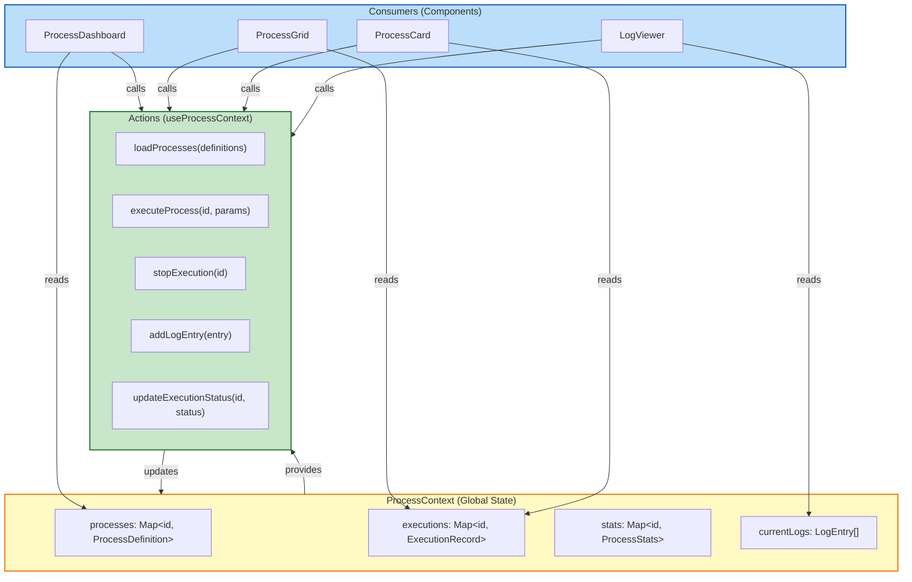

---

## 5. API REST Endpoints

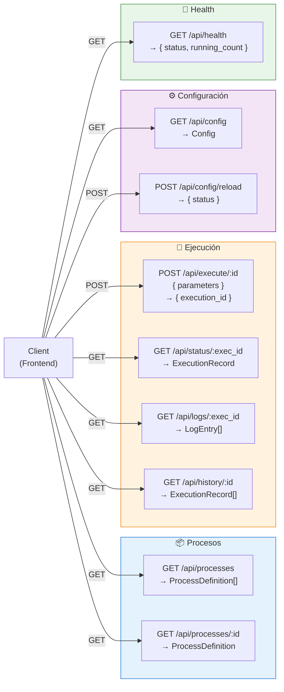

---

## 6. WebSocket Events

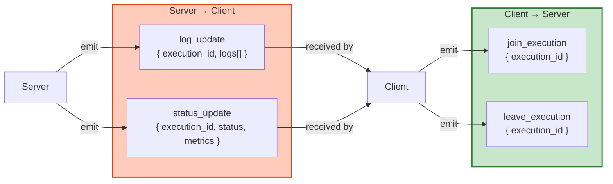

---

## 7. Ciclo de Vida de un Proceso

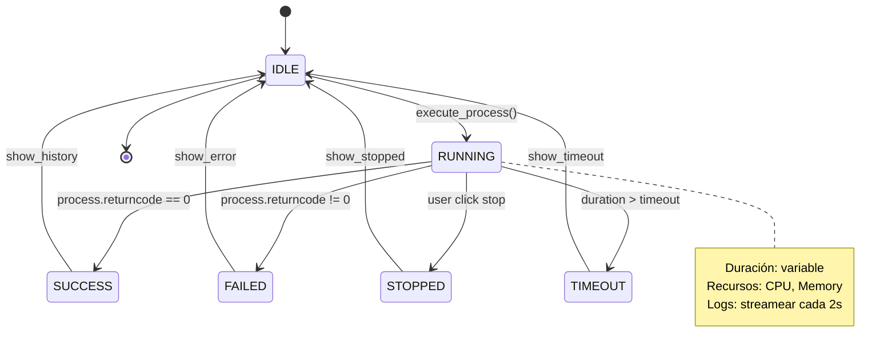

---

## 8. Responsabilidades por Capas

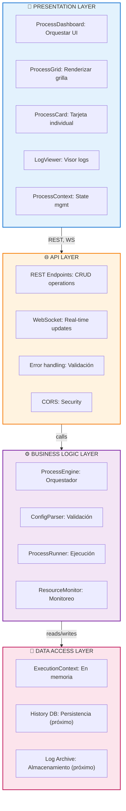

---

## 9. Matriz de Responsabilidades

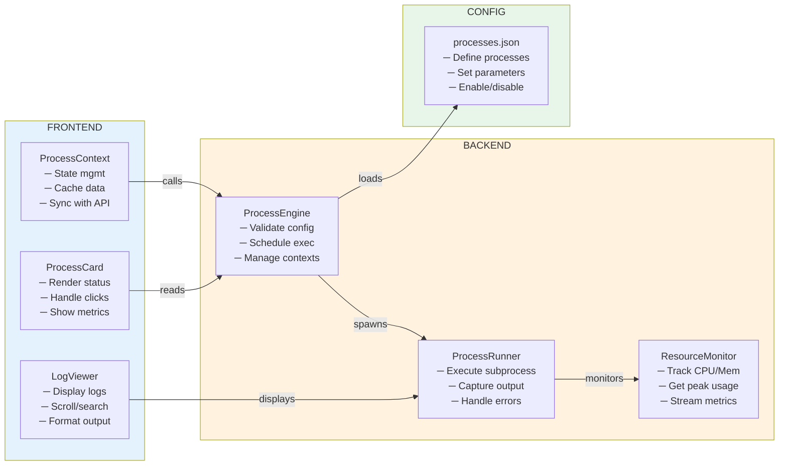

---

## 10. Performance & Escalabilidad

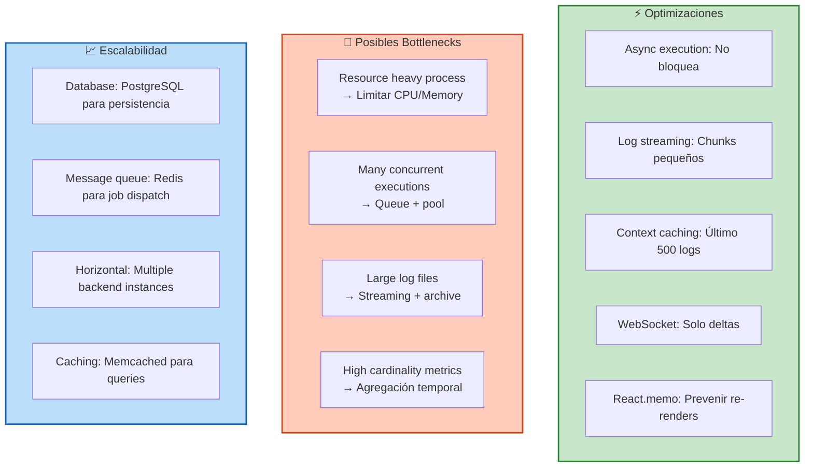

---

## 11. Flujo de Configuración

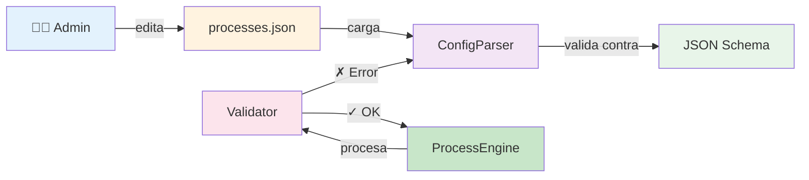

---

## 12. Matriz de Tecnologías

```
┌─────────────────────────────────────────────────────────────┐
│                   TECHNOLOGY STACK                           │
├─────────────────────────────────────────────────────────────┤
│ FRONTEND                                                     │
│ ├─ React 19.2.4 (componentes, hooks)                         │
│ ├─ MUI 5.0.6 (componentes, theming)                          │
│ ├─ TypeScript (type safety)                                  │
│ ├─ Context API (state management)                            │
│ ├─ Vite (build tool)                                         │
│ └─ WebSocket (real-time)                                     │
│                                                               │
│ BACKEND                                                      │
│ ├─ Python 3.9+ (runtime)                                     │
│ ├─ Flask (web framework)                                     │
│ ├─ Flask-SocketIO (WebSocket)                                │
│ ├─ psutil (resource monitoring)                              │
│ ├─ subprocess (process execution)                            │
│ └─ threading (async execution)                               │
│                                                               │
│ INFRASTRUCTURE (próximo)                                     │
│ ├─ PostgreSQL (persistence)                                  │
│ ├─ APScheduler (job scheduling)                              │
│ ├─ Redis (message queue)                                     │
│ └─ Docker (containerization)                                 │
│                                                               │
│ TESTING (próximo)                                            │
│ ├─ pytest (unit tests)                                       │
│ ├─ Jest (component tests)                                    │
│ └─ Cypress (e2e tests)                                       │
└─────────────────────────────────────────────────────────────┘
```

---

## 13. Propuesta de Migración - Timeline

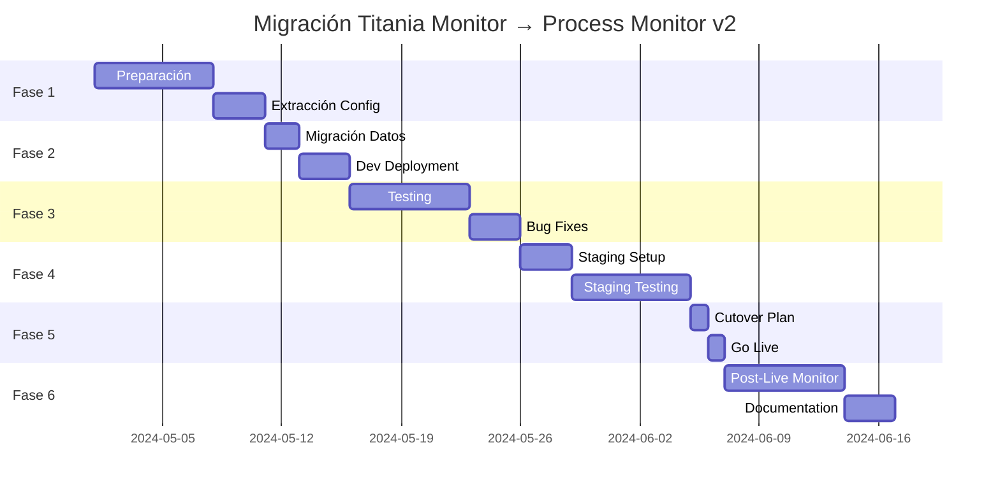

