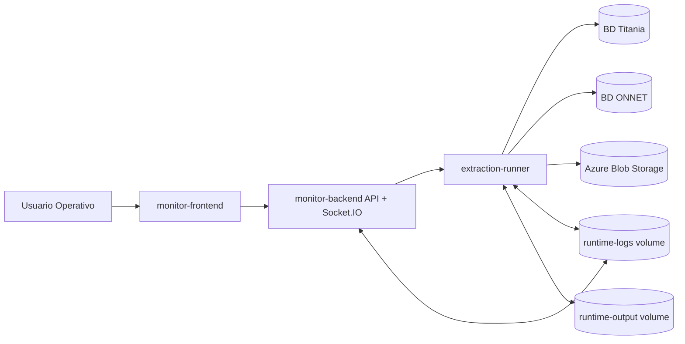

# Arquitectura de despliegue Docker

## Objetivo

Definir la arquitectura operativa para desplegar BPA Data Solutions en un host unico con Docker Compose, manteniendo continuidad productiva para Titania, ONNET y Monitor.

## Topologia propuesta

## Servicios

1. monitor-frontend
- Rol: interfaz de operacion (procesos, historial, logs, analytics).
- Exposicion: puerto publico 5173 o 80 con proxy.
- Dependencia: monitor-backend.

2. monitor-backend
- Rol: API de orquestacion, estado, historial y emision de logs/eventos.
- Exposicion: puerto interno 5052.
- Dependencias: extraction-runner, configuracion por entorno.

3. extraction-runner
- Rol: ejecucion de ONNET/Titania via unified_extraction.
- Exposicion: sin puertos publicos.
- Dependencias: conectividad BD, credenciales, Blob.

## Principios de arquitectura

1. Una sola instancia activa del scheduler para evitar doble disparo.
2. Secretos fuera del repositorio, inyectados por entorno.
3. Validacion fail-fast cuando falten variables criticas.
4. Gate de cierre por evidencia real: API + archivos locales + Blob.

## Flujo de corrida

1. Frontend solicita ejecucion manual o scheduler dispara trabajo.
2. Backend crea execution_id y delega al runner.
3. Runner ejecuta extractor con validaciones pre-run y post-run.
4. Runner genera CSV en runtime-output y publica logs en runtime-logs.
5. Runner sube archivos a Blob y valida last_modified remoto.
6. Backend expone estado final y evidencia de corrida.

## Contrato minimo de variables

1. PROCESS_MONITOR_PORT=5052
2. PROCESS_MONITOR_API_BASE_URL
3. ONNET_ENV_FILE
4. TITANIA_CREDENTIALS_FILE
5. AZURE_STORAGE_CONNECTION_STRING
6. AZURE_STORAGE_CONTAINER
7. EXPORT_ENABLE_LOCK

## Riesgos y controles

1. Riesgo: backend y frontend desalineados en puerto/base URL.
- Control: variable unica API base y health check cruzado.

2. Riesgo: locks huerfanos tras salida temprana.
- Control: limpieza automatica de stale locks antes de correr.

3. Riesgo: falso exito por returncode sin evidencia.
- Control: verificacion obligatoria de mtimes locales y Blob remoto.

## Criterio de listo para produccion

1. Dos corridas consecutivas ONNET/Titania sin fallos ni locks huerfanos.
2. Trazabilidad completa por execution_id.
3. Endpoint de health y dashboard operativos en ventana de validacion.
